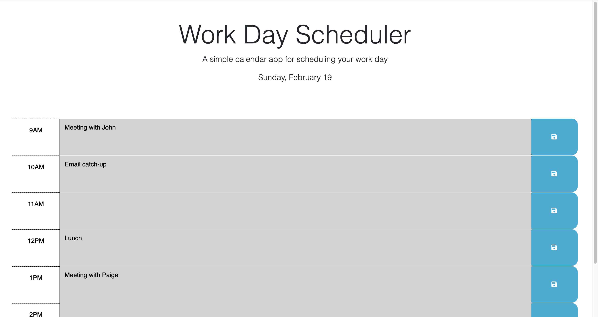

# work-day-scheduler

In this project, I added to the starter code to accomplish the following:

1. When the planner is opened, a full work day with standard business hours is in view (9am-5pm).
2. When the planner is opened, the current day is displayed at the top of the calendar.
3. Each time block is color-coded to indicate whether it is in the past, present or future related to the current day.
4. When the user clicks on a time block, text can be entered for each hour.
5. When the user clicks the "Save" button to the right of the corresponding text area, the entered text is saved in local storage.
6. Also, when the user clicks "Save", an alert pops up to inform them that their event has been saved to local storage.
7. When the user refreshes the page, the saved event(s) persist.

## Link:

[https://hollyhleal.github.io/work-day-scheduler/](https://hollyhleal.github.io/work-day-scheduler/)

## Screenshot:

